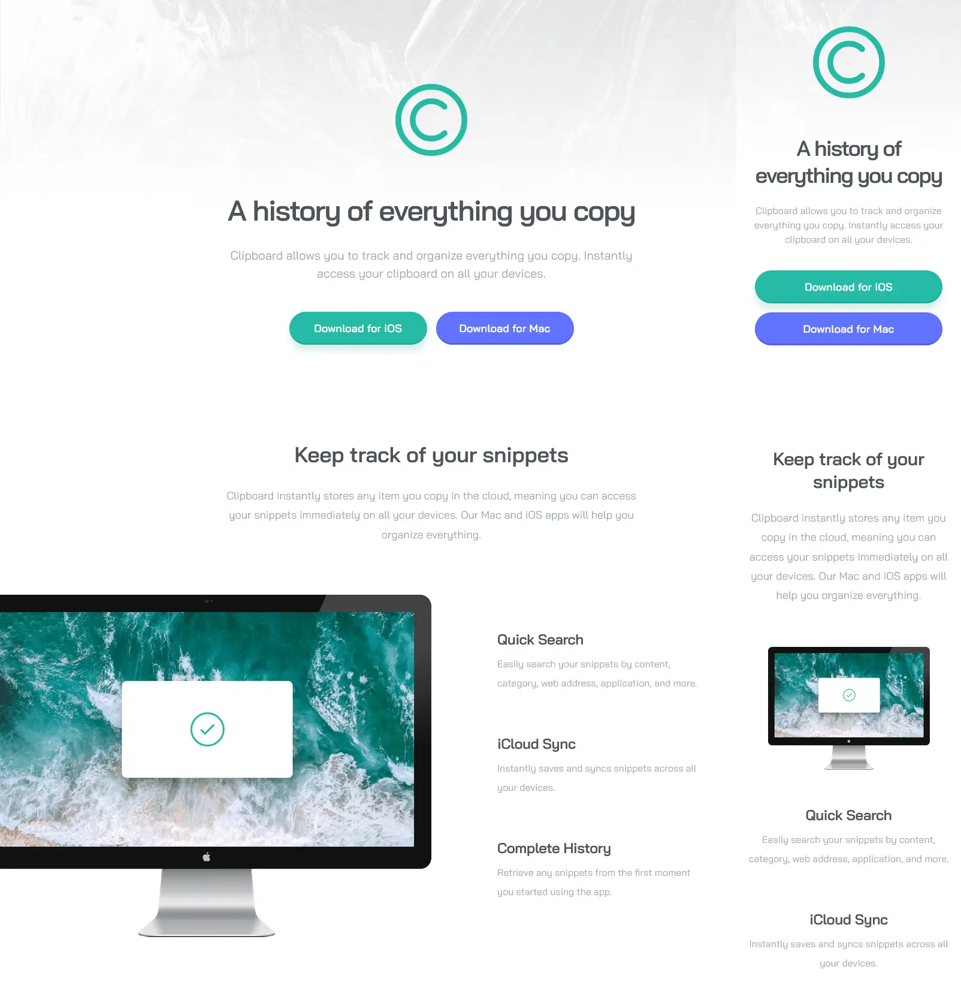

# Frontend Mentor - Clipboard landing page solution

This is a solution to the [Clipboard landing page challenge on Frontend Mentor](https://www.frontendmentor.io/challenges/clipboard-landing-page-5cc9bccd6c4c91111378ecb9). Frontend Mentor challenges help you improve your coding skills by building realistic projects.

## Table of contents

- [Overview](#overview)
  - [The challenge](#the-challenge)
  - [Screenshot](#screenshot)
  - [Links](#links)
- [My process](#my-process)
  - [Built with](#built-with)
  - [What I learned](#what-i-learned)
- [Author](#author)

## Overview

### The challenge

Users should be able to:

- View the optimal layout for the site depending on their device's screen size
- See hover states for all interactive elements on the page

### Screenshot

### Links

- Solution URL: [Add solution URL here](https://your-solution-url.com)
- Live Site URL: [Add live site URL here](https://your-live-site-url.com)

## My process

### Built with

- Semantic HTML5 & CSS
- Flexbox
- CSS Grid
- Desktop-first workflow

### What I learned

- When several sections exist on a page, it's better to position them separately, without flexboxing the entire `<body>` or `<main>` element.
- Line-height starts from the bottom of the line, and adds space above the line (which is counter-intuitive), and should be considered when vertically spacing different text elements (such as a subheading and a paragraph).
- Easier to work with SVG images when they're inserted natively in HTML, even though it makes the HTML more messy.

## Author

- [Frontend Mentor - RainOfTea](https://www.frontendmentor.io/profile/RainOfTea)
- [GitHub - RainOfTea](https://github.com/RainOfTea)
